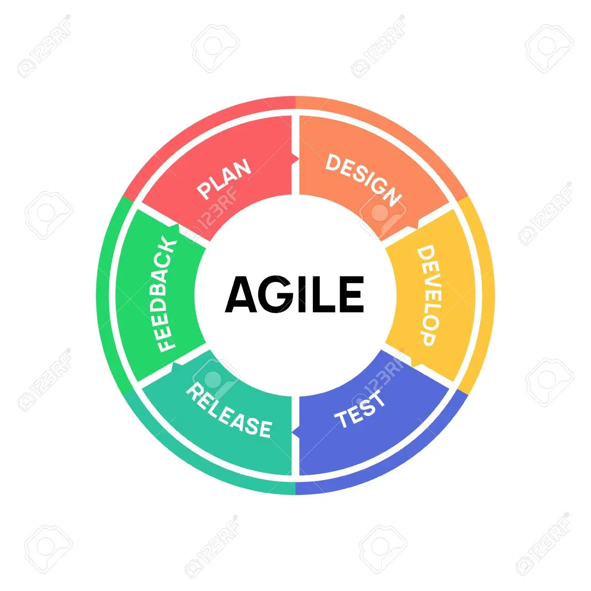

 

**Hi, I'm Julio. I have worked in multiple multinationals over the years. Even though I have a wide experience in the world of IT (SaaS, PaaS, IaaS), I have specialized in Databases and reporting, being Linux RedHat, networking and web technologies another strong point of my skills.

Specialties:Project Management,Scrum Master, Kanban, GIS, VMWare, SaaS, PaaS, IaaS, Unix/Linux, Databases, SAP, AS400, SQL server, MySQL, HTML, Javascript, BootStrap, Visual Basic, .NET, C# among others.**

I'm part of Libnova project management team since early 2023.

Visit the following link for more details 

https://julioqcam.github.io/

&nbsp;
 &nbsp;
 &nbsp;
 &nbsp; &nbsp;
 &nbsp;
 

--------

